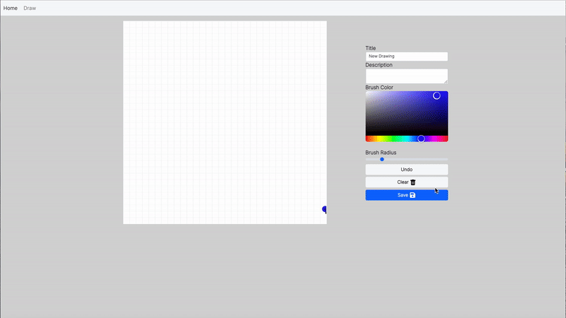

# REACT Daily Doodle Starter

### Github Link: 
[View Code: my_daily_doodle_starter](https://github.com/Oliviapark113/my_daily_doodle_starter).

## User Story
A full stack MERN app to provide users draing tools to draw , save , delete and view drawings.

## Used
Mongoose, Express, React 

## Installation 

 `npm i react-canvas-draw`
 `npm i react-colorful`
 `npm i react-icons`
 
## Credits 

This is Class activities created by Instructor and I followed along the code to learn MERN react full stack application and I have added delete, edit and update feature and responsive feature.

## DEMO 

### Deployed Link: 
[Deployed Sites:My_daily_doodle_starter](https://desolate-harbor-56312.herokuapp.com/).
